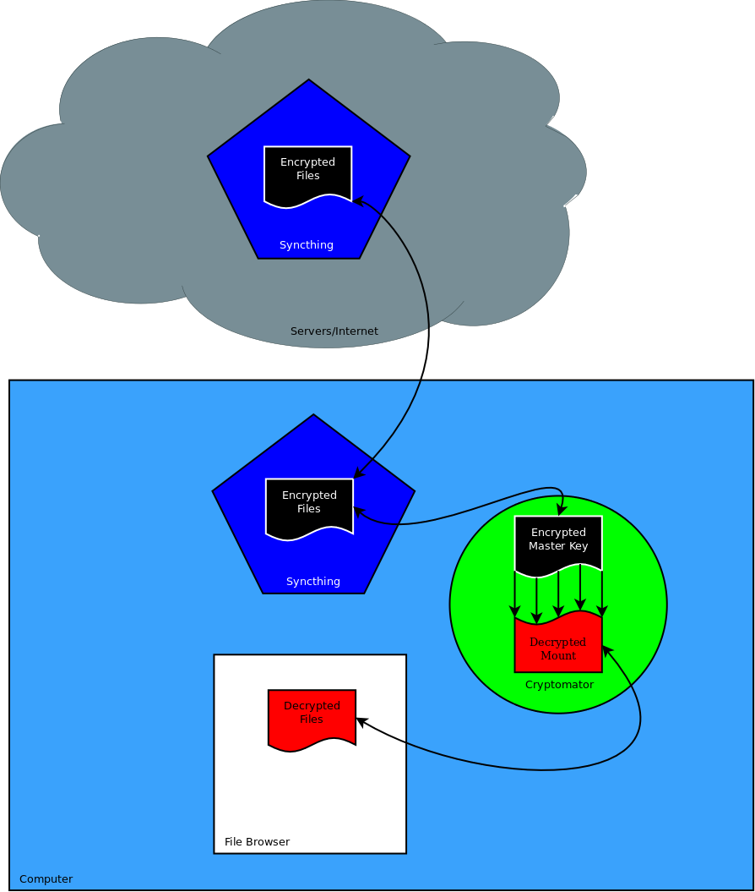
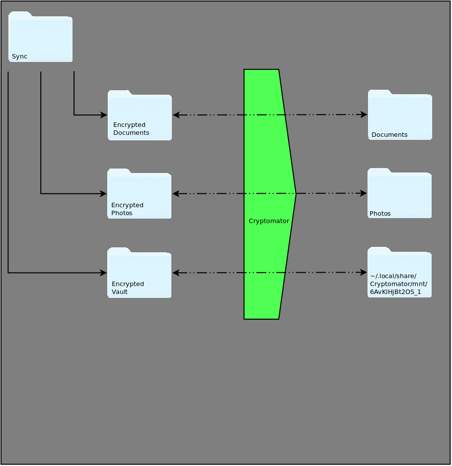

# Overview

When utilizing Syncthing between desktop computers, phones, and the Syncthing server, files located on the server may be plaintext. This could cause compromise if someone was to gain access to the files on the server if the server is on. The hard drive is encrypted but only when power is removed. To increase security, all files should be synced using Cryptomator. This will ensure files at rest on the server are always encrypted. This will also ensure files are encrypted as they transverse through the internet and prevent unauthorized access should the modem/router/wi-fi be compromised. This document covers how to setup the correct file structure per VM or OS.



# File Management

The idea is to have the folders of the encrypted files synced in another location besides the ```Document``` like folders. Then when utilizing Cryptomator to decrypt the files and mount it to a location, ```Document``` could be mounted over with the decrypted files. This could also server a decoy with fake files located in ```Document``` if the device happens to be investigated. [**UPDATE**] Cryptomator will not allow the decrypted files to be mounted over other files. The directory must be empty.



## Example

Within the ```/home/$USER/``` directory, you utilize one directory to hold all the encrypted sync files. For example ```/home/$USER/Sync/``` and within that folder would have all the Cryptomator vaults. The following example is for a school-used device. In ```/home/$USER/Sync/``` create a new vault called ```documents``` and ```photos```. This will create new directories so the file structure will now look like ```/home/$USER/Sync/documents/masterkey.cryptomator``` and ```/home/$USER/Sync/photos/masterkey.cryptomator```. When going to decrypt them, click the more options button. Use the ```Custom Mount Point``` and select the proper folder within the ```/home/$USER/``` folder.

# Notes

Syncthing should only be used for working documents. Once the file is ready for archive purposes, it should be moved to the Nextcloud server. The Nextcloud server provides encryption at rest and the ability to access the file through the application or web if needed for reference.

A list of Syncthing devices and folder IDs should be placed on a secure and encrypted server. This will allow new devices to add previous devices and folder IDs so syncing can happen.
